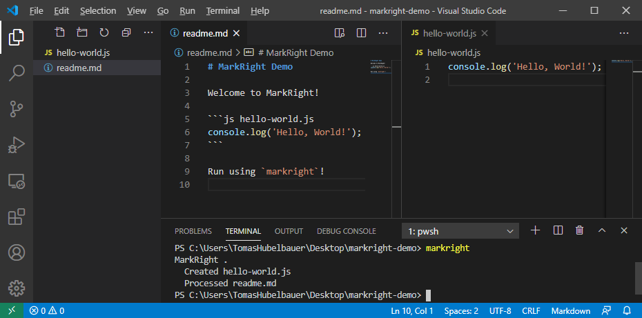

# MarkRight

[](https://github.com/tomashubelbauer/markright/actions)
[](https://github.com/tomashubelbauer/markright/stargazers)
[](https://github.com/tomashubelbauer/markright/stargazers)
[](https://github.com/tomashubelbauer/markright/network/members)
[](license.md)
[](https://github.com/sponsors/tomashubelbauer)
[](https://github.com/tomashubelbauer/markright/releases)



**MarkRight** is a tool for didactic literate programming. It scans a MarkDown
document for fenced code blocks and takes action on ones whose info strings mark
a MarkRight action:

~~~
```js hello-world.js
console.log('Hello, world!');
```
~~~

This will create a JavaScript file named `hello-world.js`.

~~~
```sh
rm hello-world
```
~~~

This will delete the `hello-world.js` file by running a shell script.

MarkRight treats a MarkDown document as a single source of truth and lets all of
the other source code fall out, specification and implementation are forced to
remain synchronized and can never diverge.

See the [**`feature-showcase` example**](example/feature-showcase) for a rundown
of all MarkRight features.

MarkRight is intended for use with didactic media (tutorials, documentation, …).

## Installation

### NPM/NPX

`npm i -g tomashubelbauer/markright` or `npx tomashubelbauer/markright` ad-hoc

You might need to run `git submodule update --recursive --init` to install the
dependencies.

### Releases

Windows, macOS and Linux binaries are available in [Releases].

[Releases]: https://github.com/tomashubelbauer/markright/releases/latest

## Usage

- `markright` (`readme.md`)
- `markright build` (`readme.md`)
- `markright build document.md`
- `markright watch` (`readme.md`)
- `markright watch document.md`

## Examples

See the [`example` directory](example) subdirectories for a variety of examples.

To run MarkRight from source against an example in that directory, run
`npm start example/${name}` (`markright watch example/${name}`).

## Source Control

The generated content should still be tracked in source control to ensure it is
easily accessibly even without running MarkRight to generate it. This is useful
for source control web UIs and further emphasises the goal of didactic benefit.

## Limitations

- MarkRight converts CRLF in file text into LF for easier internal processing
- MarkRight assumes all text files it is fed are UTF-8 without BOM without check
- MarkRight reserves `?` and `!` at the end of file names for action modifiers
- MarkRight reserves `_` as a placeholder file name, won't use `_` name verbatim
- MarkRight can't output `~` and `` ` `` into file names due to MarkDown syntax
  rules (neither is allowed in a fenced code block info string)
- MarkRight's only supported way of referencing/pulling external assets is thru
  the use of scripts (`mv`, `cp`, `curl`, `wget`, whatever other way…)

## License

MarkRight is licensed under the terms of the [AGPL 3.0only](license.md) license.

## Development

Run `npm run dev` to run the `example/feature-showcase` document which contains
all features.

Run `npm test` to run all `*.test.js` modules as well as all `example` directory
documents. Run `npm test ${regex}` to run only matching `*.test.js` modules and
no `example` directory documents.

Run `npx tomashubelbauer/esm2cjs` followed by `npx pkg .` to build the binaries
for Windows, macOS and Linux.

### Changelog

MarkRight is in WIP mode at the moment. The version is `0.0.0` and a release is
cut for each commit which passes the CI tests. Once MarkRight reaches `1.0`,
semantic versioning will be used instead and releases will be cut with each
version change and will contain a proper changelog.

### To-Do

#### Address code to-do comments

Use [`todo`](https://github.com/tomashubelbauer/todo).

#### Cache the unchanged layers

Do not run the whole document each time, recognize the changed part (usually the
very end) and run only the part that has changed.

#### Think about VS Code Intellisense support

This one is going to be very tricky… For each code block, we need to determine
the full content of the file it relates to (because it might be a patch block)
and use that code to fuel the Intellisense for the given language.

Remains to be seen if this is going to even be possible using the VS Code API.

It might also be necessary to either store the texts in temporary files or use
the generated files and only "translate" the cursor in the code block to the
backing content in the generated file so that things like modules work (VS Code
knows what to suggest for module paths etc.).

#### Use a more concise syntax for shell code block info string options

Right now the options are in JSON, which is verbose, we could get something more
tailored and concise.

~~~
```sh 0 "Hello, world!"
node .
```
~~~

This will check stdout for the given text and also stderr for emptiness.

~~~
```sh 1 "No argument provided"
node .
```
~~~

This will check stderr for the given text and also stdout for emptiness.

Maybe this could be allowed, too:

~~~
```sh 1 "Argument count: 0" "No argument provided"
node .
```
~~~

To check both stdout and stderr at the same time.

#### Consider allowing regex pre-processing in standard I/O checks

This would be useful for normalizing things like file system  paths, dates and
random numbers in the output. E.g.:

~~~
```stdout \d+ g {random number}
Your random number is: {random number}.
```
~~~

Also applies to the inline standard I/O checks in shell code block options.

#### Support mixed `+` and `-` in patch and support unchanged lines in patch

Unchanged lines in patch will make detecting patch from insert/append harder but
it should still be possible to detect: all lines either start with a sign symbol
or are present in the file verbatim [in case of unchanged lines] in the correct,
patch, order.

#### Add support for taking in changes and turning them to MarkRight instructions

This feature might make the need for Intellisense support a little less urgent:

Author MarkRight and each time a more complex code change is needed to be done
to a generated file, just make it there. MarkRight will have a command to tell
it to pull in the changes made to the generated files as compated to what it
would generate as currently written. Once these changes are gathered, fenced
code blocks from them are appended to the MarkRight document. The most optimal
type of fenced code block (`patch` or `!`) is chosen.

If running in watch mode, MarkRight should  recognize changes made to the
generated files (by the user, not the ones it does while generating them) and
append and update the pending auto-generated appended code blocks as long as
the user keeps changing the generated files. Take them as committed once the
user edits the MarkRight document itself again, at which point a new set of live
fenced code blocks should be generated and kept being refreshed while the user
edits the generated files.

#### Fix the `Pkg: Error reading from file.` error using `rcedit` on the binary

When using this in the CI to apply an icon to the Windows executable:

```
curl -L https://github.com/electron/rcedit/releases/latest/download/rcedit-x64.exe -o rcedit.exe
./rcedit markright-win.exe --set-icon icon.ico
```

I get the above error while running the executable. Before applying the icon,
the executable works just fine.

#### Fix changes in the document picked out by the watcher resulting in empty run

Here and there after the initial `npm test` run, when the `readme.me` is changed
and the `watch` picks it up, the only line printed is `Processed readme.md`, but
none of the code-blocks have actually run.

#### Consider enabling printing stdout/stderr of a long running script out

#### Allow using a regex for `stdout` check to be able to capture optional lines

~~~
```stdout regex
(Tool installed!)?\r?\n
Version: 0.0.0
```
~~~

The above will match both:

```
Tool installed!
Version: 0.0.0
```

As well as:

```
Version: 0.0.0
```

#### Allow marking scripts by the platform they should run on

- `powershell win` runs on Windows, skipped elsewhere
- `powershell win,linux` runs on Windows and Linux, skipped elsewhere
- `bash macos` runs on macOS, skipped elsewhere

Authors will have an option to include several scripts, on for each platform,
and only the correct one for the given platform will be executed.

#### Fix fenced code block with just `powershell` for language creating a file

~~~
```powershell
yo code `
  --extensionType command-ts `
  --extensionDisplayName MarkRight `
  --extensionName vscode-markright `
  --extensionDescription "MarkRight support for VS Code" `
  --gitInit false `
  --pkgManager npm `

```
~~~

This fenced code block resulted in a file by the name of `powershell` being
created, when it should just be skipped instead.

#### Develop a VS Code extension which bundles MarkRight and runs it on `*.md`

The extension would active on MarkDown files in general or maybe on MarkDown
files which already have MarkRight fenced code blocks and would ask if it
should watch the file for you and run it each time you save your changes to it.

https://github.com/tomashubelbauer/markright-vscode

#### Allow titling shell code blocks

~~~
```sh run-a-script
...
```
~~~

In the output of MarkRight this should print:
`Executed run-a-script shell script`

We need to figure out how to make this work with `stdout` and `stderr` checks.

#### Add a command line option to erase the directory prior to the run

This will be useful in prototyping as the starting conditions will always be
known so unexpected states (files conflicting with moves, incorrect versions of
dependencies being installed etc.) are minimized.

It's always ideal to handle this stuff in the script dynamically, recognize and
act on the various exceptional conditions, but to aid prototyping, we'll provide
this quality of life improvement.

#### Offer an option to run in Windows Sandbox by using a shared directory

Probably by allowing `wsb` as a control keyword in a shell script fenced code
block info string. For prototyping, `wsb` could be the language tag itself.

Prototyped in `wsb.js`.

##### Docker

As a more general option / an alternative on macOS and Linux, Docker could be
used in the same way if installed.

#### Add a `node` shell script type which runs Node and tell the version used

Run using:

```sh
node -e "line 1
line 2
line 3"
```

Maybe `node` can be passed to `shell` in `child_process.exec`?

#### Fix the issue with binaries not being found in `%PATH%` when they are there

Shell script in MarkDown will not find a newly installed binary in PATH even if
using another shell script block to force reloading PATH. This is persistent, I
have not been able to make the binary work across restarts of MarkRight, the IDE
etc.

Perhaps MarkRight should explicitly set path each time it runs a shell script
(can this be done?) and check the path when a script ends and make sure that
newly added entries are sent to the new script block.

#### Allow running the whole MarkRight document execution in Windows Sandbox

In addition to running individual script blocks this way. Probably a CLI option.

#### Allow inspecting the standard output of any script using `markright stdout`

Once titling scripts is implemented, add this command which will print the last
stdout known for this script based on a cache where all stdout will be stored.
Maybe we should require MarkRight be run with `--cache` or similar to tell it to
do cache the stdout (stdio?) data to avoid surprising behavior with potentially
giant caches.

#### Check that the language tag is a-z0-9 and pull impl from `lang/${tag}`

Pull out the various implementations from a module file using `await import` and
error/fallback if they don't exist like is done currently.

#### Allow a script to be both executed and output to a file at once

Currently it is one or the other.

#### Make ESM2CJS ignore (or select) given files to avoid changes in submodules

This will simplify `main.yml`.

#### Polish VS Code screencast and use for programmatic animated screenshot

https://github.com/TomasHubelbauer/code-extension-screencast

https://github.com/TomasHubelbauer/node-cdp-ws

See if in the workflow, we could install and start VS Code, get ahold of its API
interface, run a script which uses the API interface to demonstrate MarkRight in
action, make a screenshot and commit it with the version bump if it has changed.

#### Replace previous output line with the current one and show step counter

Right now the output looks like this:

```
Created test
Executed shell script
Verified stdout match
…
```

Perhaps there should be only a single line which would update to always show the
latest that's happening and could show opening and closing message for each step
so that long-running actions (like WSB) would show `Executing sandbox script…`
for a while and then `Executed sandbox script` would flash followed by whatever
step came next.

Also the line could be prefixed by the current code block number in the document
order or even better a line number (and if we go that route a percentage or even
a progress bar could be displayed).

Maybe this is only appropriate for the watch mode and not for the build mode? I
need to look into how this stuff works and what it leaves in the standard output
stream, for the build mode we definitely want a faithful record of all the steps
in the standard output.

#### Use Caxa for ESM-compatible executable packaging

https://github.com/leafac/caxa
